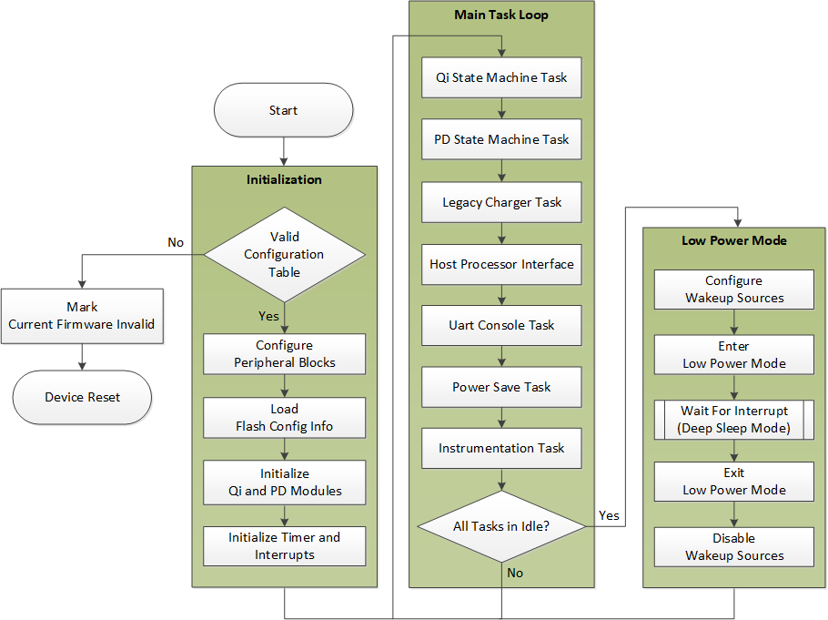
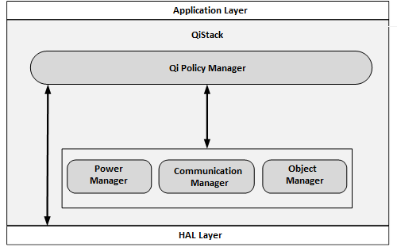
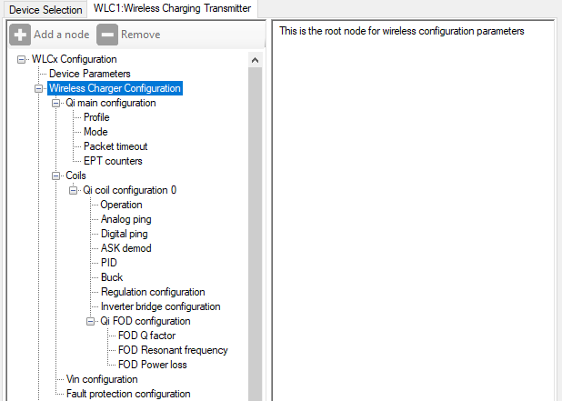
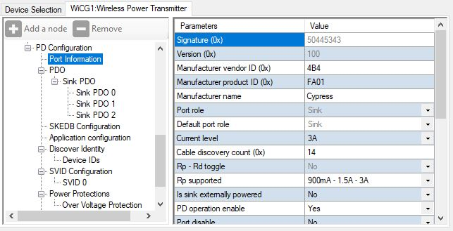
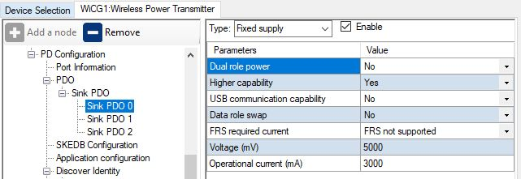
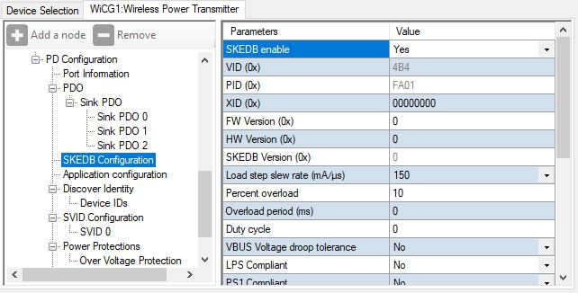

# WLC PTx EPP: Wireless power transmitter EPP application

This code example demonstrates the wireless charging power transmitter EPP function with USB-PD sink as the power input.

[View this README on GitHub.](https://github.com/Infineon/mtb-example-wlc1-ptx-epp)

[Provide feedback on this code example.](https://cypress.co1.qualtrics.com/jfe/form/SV_1NTns53sK2yiljn?Q_EED=eyJVbmlxdWUgRG9jIElkIjoiQ0UyMzUzOTQiLCJTcGVjIE51bWJlciI6IjAwMi0zNTM5NCIsIkRvYyBUaXRsZSI6IldMQyBQVHggRVBQOiBXaXJlbGVzcyBwb3dlciB0cmFuc21pdHRlciBFUFAgYXBwbGljYXRpb24iLCJyaWQiOiJzdWt1IiwiRG9jIHZlcnNpb24iOiIxLjAuMCIsIkRvYyBMYW5ndWFnZSI6IkVuZ2xpc2giLCJEb2MgRGl2aXNpb24iOiJNQ0QiLCJEb2MgQlUiOiJXSVJFRCIsIkRvYyBGYW1pbHkiOiJUWVBFLUMifQ==)

## Requirements

- [ModusToolbox&trade; software](https://www.cypress.com/products/modustoolbox-software-environment) v2.4 or later (tested with v2.4)
- Set the CY_SUPPORTED_KITS environment variable with the value of "CCG7D" to enable support for the CCGx parts under ModusToolbox&trade; software
- Set the CyRemoteManifestOverride environment variable with the value of "https://git-ore.aus.cypress.com/VenkatK/mtb-wlc1-src-manifest/raw/main/mtb-wlc1-super-manifest.xml" to enable BSP support for the CCGx parts
- Programming language: C
- Associated parts: All [WLCx](https://www.infineon.com/cms/en/product/power/wireless-charging-ics/) parts

## Supported toolchains (make variable 'TOOLCHAIN')

- GNU Arm® embedded compiler v9.3.1 (`GCC_ARM`) - Default value of `TOOLCHAIN`
- Arm&reg; compiler v6.13 (`ARM`)
- IAR C/C++ compiler v8.4 (`IAR`)

## Supported kits (make variable 'TARGET')

- WLC1 15W Reference Board: [REF_WLC_TX15W_C1](http://www.infineon.com/ref-wlc-tx15w-c1) (`WLC1115-68LQXQ`) – Default value of `TARGET`


## Hardware setup

1. Connect the board to your PC using the USB cable through the KitProg3 USB connector. This cable is used for programming the WLC1 device. It is also used during debugging.

2. Connect the USBPD port to the USB-C power adapter. This cable is used for the USB power delivery source and it provides power to the user LED.

See the kit user guide for more details on configuring the board.


## Software setup

This example does not require additional software or tools.


## Using the code example

Create the project and open it using one of the following:

<details><summary><b>In Eclipse IDE for ModusToolbox&trade; software</b></summary>

1. Click the **New Application** link in the **Quick Panel** (or, use **File** > **New** > **ModusToolbox Application**). This launches the [Project Creator](https://www.cypress.com/ModusToolboxProjectCreator) tool.

2. Pick a kit supported by the code example from the list shown in the **Project Creator - Choose Board Support Package (BSP)** dialog.

   When you select a supported kit, the example is reconfigured automatically to work with the kit. To work with a different supported kit later, use the [Library Manager](https://www.cypress.com/ModusToolboxLibraryManager) to choose the BSP for the supported kit. You can use the Library Manager to select or update the BSP and firmware libraries used in this application. To access the Library Manager, click the link from the **Quick Panel**.

   You can also just start the application creation process again and select a different kit.

   If you want to use the application for a kit not listed here, you may need to update the source files. If the kit does not have the required resources, the application may not work.

3. In the **Project Creator - Select Application** dialog, choose the example by enabling the checkbox.

4. (Optional) Change the suggested **New Application Name**.

5. The **Application(s) Root Path** defaults to the Eclipse workspace which is usually the desired location for the application. If you want to store the application in a different location, you can change the *Application(s) Root Path* value. Applications that share libraries should be in the same root path.

6. Click **Create** to complete the application creation process.

For more details, see the [Eclipse IDE for ModusToolbox&trade; software user guide](https://www.cypress.com/MTBEclipseIDEUserGuide) (locally available at *{ModusToolbox&trade; software install directory}/ide_{version}/docs/mt_ide_user_guide.pdf*).

</details>

<details><summary><b>In command-line interface (CLI)</b></summary>

ModusToolbox&trade; software provides the Project Creator as both a GUI tool and the command-line tool, "project-creator-cli". The CLI tool can be used to create applications from a CLI terminal or from within batch files or shell scripts. This tool is available in the *{ModusToolbox&trade; software install directory}/tools_{version}/project-creator/* directory.

Use a CLI terminal to invoke the "project-creator-cli" tool. On Windows, use the command line "modus-shell" program provided in the ModusToolbox&trade; software installation instead of a standard Windows command-line application. This shell provides access to all ModusToolbox&trade; software tools. You can access it by typing `modus-shell` in the search box in the Windows menu. In Linux and macOS, you can use any terminal application.

This tool has the following arguments:

Argument | Description | Required/optional
---------|-------------|-----------
`--board-id` | Defined in the `<id>` field of the [BSP](https://github.com/Infineon?q=bsp-manifest&type=&language=&sort=) manifest | Required
`--app-id`   | Defined in the `<id>` field of the [CE](https://github.com/Infineon?q=ce-manifest&type=&language=&sort=) manifest | Required
`--target-dir`| Specify the directory in which the application is to be created if you prefer not to use the default current working directory | Optional
`--user-app-name`| Specify the name of the application if you prefer to have a name other than the example's default name | Optional


The following example will clone the "[WLC1 EPP Power Transmitter](https://github.com/Infineon/mtb-example-wlc1-ptx-epp)" application with the desired name "WLC1_EPP_Power_Transmitter" configured for the *WLC1115-68LQXQ* BSP into the specified working directory, *C:/mtb_projects*:

   ```
   project-creator-cli --board-id WLC1115-68LQXQ --app-id mtb-example-wlc1-ptx-epp --user-app-name mtb-example-wlc1-ptx-epp --target-dir "C:/mtb_projects"
   ```

**Note:** The project-creator-cli tool uses the `git clone` and `make getlibs` commands to fetch the repository and import the required libraries. For details, see the "Project creator tools" section of the [ModusToolbox&trade; software user guide](https://www.cypress.com/ModusToolboxUserGuide) (locally available at *{ModusToolbox&trade; software install directory}/docs_{version}/mtb_user_guide.pdf*).

</details>

<details><summary><b>In third-party IDEs</b></summary>

Use one of the following options:

- **Use the standalone [Project Creator](https://www.cypress.com/ModusToolboxProjectCreator) tool:**

   1. Launch Project Creator from the Windows Start menu or from *{ModusToolbox&trade; software install directory}/tools_{version}/project-creator/project-creator.exe*.

   2. In the initial **Choose Board Support Package** screen, select the BSP, and click **Next**.

   3. In the **Select Application** screen, select the appropriate IDE from the **Target IDE** drop-down menu.

   4. Click **Create** and follow the instructions printed in the bottom pane to import or open the exported project in the respective IDE.

<br>

- **Use command-line interface (CLI):**

   1. Follow the instructions from the **In command-line interface (CLI)** section to create the application, and then import the libraries using the `make getlibs` command.

   2. Export the application to a supported IDE using the `make <ide>` command.

   3. Follow the instructions displayed in the terminal to create or import the application as an IDE project.

For a list of supported IDEs and more details, see the "Exporting to IDEs" section of the [ModusToolbox&trade; software user guide](https://www.cypress.com/ModusToolboxUserGuide) (locally available at *{ModusToolbox&trade; software install directory}/docs_{version}/mtb_user_guide.pdf*).

</details>

## Operation

1. Ensure that the steps listed in the [Hardware setup](#hardware-setup) section are completed.

2. Program the board using one of the following:

   <details><summary><b>Using Eclipse IDE for ModusToolbox&trade; software</b></summary>

      1. Select the application project in the Project Explorer.

      2. In the **Quick Panel**, scroll down, and click **\<Application Name> Program (KitProg3_MiniProg4)**.
   </details>

   <details><summary><b>Using CLI</b></summary>

     From the terminal, execute the `make program` command to build and program the application using the default toolchain to the default target. The default toolchain and target are specified in the application's Makefile but you can override those values manually:
      ```
      make program TARGET=<BSP> TOOLCHAIN=<toolchain>
      ```

      Example:
      ```
      make program TARGET=WLC1115-68LQXQ TOOLCHAIN=GCC_ARM
      ```
   </details>

## Debugging

You can debug the example to step through the code. In the IDE, use the **\<Application Name> Debug (KitProg3_MiniProg4)** configuration in the **Quick Panel**. Ensure that the board is connected to your PC using the USB cable through the KitProg3 USB connector. See the "Debug mode" section in the kit user guide.

For more details, see the "Program and debug" section in the [Eclipse IDE for ModusToolbox&trade; software user guide](https://www.cypress.com/MTBEclipseIDEUserGuide).

## Design and implementation

**Figure 1. Firmware flowchart**



<br>

The firmware operation is divided into three sections:

### Initialization

The application firmware entry happens when the bootloader detects a valid firmware image and jumps to the specified address. The firmware first verifies the configuration information stored in flash by calculating the checksum of the table and comparing against the value stored in the table. If the checksum does not match, it automatically switches to the bootloader mode for flashing. When a valid configuration table is identified, the firmware proceeds to initialize the peripheral blocks and then enables the various system interrupts. 

### Main task loop 

The main task loop is an infinite loop executing the specific set of tasks periodically. These tasks get executed sequentially as shown in Figure 1.

- **Qi tasks:** The Qi FW module only processes high priority tasks inside the interrupt context or inside blocked critical sections. It then stores various Qi-specific interrupts and pending events and the main task loop continuously executes a Qi state machine task function which performs the actual handling. The solution manager handlers are invoked from inside this task function.

- **PD tasks:** The PD FW module only processes high priority tasks inside the interrupt context. It then stores various PD-specific interrupts and events in an event bit mask. The main task loop continuously executes a PD scheduler task functionz, which performs the actual handling. The solution manager handlers are invoked from inside this task function.

- **HPI tasks:** WLC communicates with the host processor/application processor for handling device-common commands and WiCG-specific commands. This task processes any host processor requests. Please refer to the WiCG host processor interface document, JRND-55, for more details.

- **Console tasks:** WLC provides console interface through a UART peripheral for solution status logging. This task collects console print requests in the console queue from various modules and processes them based on request priority or verbosity level.

- **Instrumentation tasks:** The instrumentation task mainly monitors the firmware state and provides a recovery path in system error events such as WDT software and hardware reset and stack overflow etc.

### Low Power mode

Sleep mode is not used in the general WLC stack implementation, as all of the tasks are implemented in the form of state machines that can have incremental work to be completed. 

The WLC devices support a low power mode called Deep Sleep. In this mode, the IMO is disabled and only ILO is functional. WLC attempts to stay in Deep Sleep mode for as long as possible when no Qi object is detected, waking up only long enough to perform any work triggered due to incoming Qi or Type-C or PD events or I2C-based requests.
<br>

## QiStack

**Figure 2. QiStack components**



- **Qi Policy manager:** The Qi Policy Manager (QPM) is the top layer and maintains the core stack state machine. It interacts with the HAL layer and low-level Qi modules such as the communication manager, object manager, and power manager for configuration, monitoring, request, control, and event handling.

- **Communication manager:** Qi uses amplitude shift keying (ASK) and frequency shift keying (FSK) for in-band communication between the transmitter and receiver. ASK is the communication mode from Rx to Tx, while FSK is the communication mode from Tx to Rx.

- **Object  manager:** The Qi transmitter detects the object and the type of object on its coil surface before initiating power transfer and also while power transfer is in progress. The object can either be Rx only or FO only or RX + FO.

- **Power  manager:** The power manager handles the inverter, coil voltage/current, and PID loop methods. 

The QiStack middleware library implements the state machines defined in the [Wireless Power Consortium Qi v1.3.2](https://www.wirelesspowerconsortium.com/knowledge-base/specifications/)
.
## PDStack

The PDStack middleware library implements the state machines defined in the [USB Type-C cable and connector](https://www.usb.org/document-library/usb-type-cr-cable-and-connector-specification-revision-20) and the [USB Power Delivery](https://www.usb.org/document-library/usb-power-delivery) specifications. PDStack consists of the following main modules:

- **Type-C manager:** Responsible for detecting a Type-C connection and identifying the type of connection. It uses the configurable Rp/Rd terminations provided by the USBPD block and the internal line state comparators. The Type-C manager implements the state machines defined in the *USB Type-C cable and connector specification* and provides the following functionality:

    - *Manage CC terminations*: Applies Rp/Rd terminations according to the port role

    - *Attach detection*: Performs the required debounce and determines the type of device attached

    - *Detach detection*: Monitors the CC line and Vbus for detecting a device detach

- **Protocol layer:** Forms the messages used to communicate between a pair of ports/cable plugs. It is responsible for forming capability messages, requests, responses, and acknowledgements. It receives inputs from the policy engine indicating which messages to send and relays the responses back to the policy engine.

- **Policy engine:** Provides a mechanism to monitor and control the USB Power Delivery system within a particular consumer, provider, or cable plug. It implements the state machines defined in the *USB Power Delivery* specification and contains implementations of all PD atomic message sequences (AMS). It interfaces with the protocol layer for PD message transmission/reception for controlling the reception of message types according to conditions such as the current state of the port. It also interfaces with the Type-C manager for error conditions such as Type-C error recovery.

- **Device policy manager (DPM):** Provides an interface to the application layer to initialize, monitor, and configure the PDStack middleware operation. The DPM provides the following functionality:

    - Initialize the policy engine and Type-C manager

    - Start the Type-C state machine followed by the policy engine state machine

    - Stop and disable the Type-C port

    - Allow entry/exit from Deep Sleep to achieve low power based on the port status

    - Provide APIs for the application to send PD/Type-C commands

    - Provide event callbacks to the application for application-specific handling

The PDStack library uses a set of callbacks registered by the application to perform board-specific tasks, such as turning the consumer power path ON/OFF and identifying the optimal source power profile to be used for charging. In this example, these functions are implemented using the appropriate APIs provided as part of the peripheral driver library (PDL).

The stack also provides notification of various connection and PD policy state changes so that the rest of the system can be configured as required. These events are used by the example application to implement a separate USB Battery Charging 1.2 sink state machine, which distinguishes between a standard downstream port (SDP), charging downstream port (CDP), and dedicated charging port (DCP).

**Bootloader**

The WLCx bootloader is a fixed function firmware segment, which is factory-programmed and provides firmware upgrade and configuration update functionality over the I2C and CC interface.

**Deep Sleep**

The application tries to keep the WLCx MCU device in Deep Sleep, where all clocks are disabled and only limited hardware blocks are enabled for most of its working time. Interrupts in the USBPD block are configured to detect any changes that happen while the device is in sleep, and wake it up for further processing.

**Fault protection**

   - *Type-C VBUS undervoltage protection (VBUS UVP)*: Incorporates a dedicated voltage comparator with an integrated digital filter that detects undervoltage on the Type-C VBUS. On VBUS undervoltage detection, the VBUS and buck-boost regulator are turned off to protect onboard components as well as the external sink devices. Voltage levels to detect undervoltage, debounce period, and retries are configurable through the Wireless Charging Configuration Utility.
   
   - *Type-C VBUS overvoltage protection (VBUS OVP)*: Incorporates a dedicated voltage comparator with an integrated digital filter that detects overvoltage on the Type-C VBUS. Type-C VBUS overvoltage handling and configurability are similar to VBUS UVP.
   
   - *Type-C VBUS overcurrent protection (VBUS OCP)*: Incorporates a current sense amplifier and a dedicated comparator with an integrated digital filter that detects overcurrent on the Type-C VBUS. Type-C VBUS overcurrent handling and configurability are similar to VBUS UVP.
   
   - *Type-C VBUS Short-circuit protection (VBUS SCP)*: Shares the current sense amplifier with VBUS OCP and incorporates a dedicated comparator with an integrated digital filter that detects overcurrent on Type-C VBUS. The debounce period and retries are configurable through the Wireless Charging Configuration Utility.
   
   - *VIN undervoltage protection (VIN UVP)*: Supports comparator-based VIN UV detection and also supports Auto Provider FET cut-off.
   
   - *VIN overvoltage protection (VIN OVP)*: Supports comparator-based VIN OV detection and also supports Auto Provider FET cut-off.
   
   - *VREG inrush current limit*: Incorporates protection against large current load on VDDD (internal regulator). This helps to avoid VDDD droop because of inrush and also unknown behavior of the device and possible brownout. The port is disabled (buck-boost turned off) after a fault is detected and device software reset is executed to recover from VDDD fault. Device reset is necessary because any misbehavior in VDDD needs to reset the device completely to start fresh firmware/hardware execution.
   
   - *VDDD brown-out detection (VDDD BOD)*: VDDD can enter the hardware brown-out level because of lower voltage or GND short on VDDD or inrush current. A software brown-out detection helps to exit the context or state cleanly by disabling buck-boost regulation and other components.

### Compile-time configurations

The WLCx MCU USBPD sink application functionality can be customized through a set of compile-time parameters that can be turned ON/OFF through the *config.h* header file.

**Table 1. Compile time configurations**

| Macro name          | Description                           | Allowed values |
| :------------------ | :------------------------------------ | :------------- |
| `CY_PD_SINK_ONLY`     | Specifies that the application supports only the USBPD sink (consumer) role | Should be set to 1u |
| `CY_PD_REV3_ENABLE`   | Enable USBPD Revision 3.0 support | 1u or 0u |
| `BATTERY_CHARGING_ENABLE` | Enables BC 1.2 (CDP/DCP) detection when connected to a non-USBPD power source | 1u or 0u |
| `SYS_DEEPSLEEP_ENABLE` | Enables device entry into deep sleep mode for power saving when the CPU is idle | 1u or 0u |
| `APP_VBUS_SRC_FET_BYPASS_EN` | Enables No Provider FET configuration | 1u or 0u |
| `QC_SRC_AFC_CHARGING_DISABLED` | Disables QC and AFC protocol support in state machine | 1u or 0u |
| `VREG_INRUSH_DET_ENABLE` | Enables Vreg inrush detection fault | 1u or 0u |
| `VREG_BROWN_OUT_DET_ENABLE` | Enables VDDD brown-out fault detection | 1u or 0u |
| `BB_ILIM_DET_ENABLE` | Enables buck-boost Ilim fault detection | 1u or 0u |
| `VBTR_ENABLE` | Enables hardware-based voltage transition slew rate | 1u or 0u |
| `VIN_OVP_ENABLE` | Enables overvoltage protection fault over VIN | 1u or 0u |
| `VIN_UVP_ENABLE` | Enables undervoltage protection fault over VIN | 1u or 0u |
| `VBUS_OCP_ENABLE` | Enables overcurrent protection fault over VBUS | 1u or 0u |
| `VBUS_SCP_ENABLE` | Enables short circuit protection fault over VBUS | 1u or 0u |
| `VBUS_UVP_ENABLE` | Enables undervoltage protection fault over VBUS | 1u or 0u |
| `VBUS_OVP_ENABLE` | Enables overvoltage protection fault over VBUS | 1u or 0u |

### PDStack library selection

The USB Type-C connection manager, USB Power Delivery (USBPD) protocol layer, and USBPD device policy engine state machine implementations are provided in the form of pre-compiled libraries as part of the PDStack middleWare library.

Multiple variants of the PDStack library with different feature sets are provided; you can choose the appropriate version based on the features required by the target application.

   - *WLC1_PD3_SNK*: Library with support for USB Type-C sink operation and USBPD Revision 3.0 messaging. This library can be used in any Power-Delivery WLCx application.

The library of choice can be selected by editing the *Makefile* in the application folder and changing the value of the `COMPONENTS` variable.


### Device configuration

The properties of the device parameters, wireless configuration, and USB PD configuration including the port role and the default response to various USBPD messages can be configured using the Wireless Charging Configuration Utility.

These parameters have been set to the appropriate values for a Power Delivery sink application by default.

**Wireless charger configuration**

**Figure 3. Qi configuration using Wireless Charging Configuration Utility**



<br>

   - *Qi main configuration*: The Qi main configuration details such as profile, mode, packet timeout, and EPT counter parameters.
   
   - *Coils*: Configure the parameters specific to the coil.
   
   - *Qi foreign object detection (FOD) configuration*: Configure Qi foreign object detection (FOD) Q factor parameters of the coil
   
   - *Vin configuration*: Enables/Disables dynamic PD contract selection based on PRx requirements to optimize power usage.
   
   - *Fault-protection configuration*: Configure parameters for the protection mechanisms.

**PD configuration**

**Figure 4. USB Type-C port configuration using Wireless Charging Configuration Utility**



<br>

Properties of the USB-C port are configured using the *Port Information* section. Because this application supports only the USBPD sink operation, the **Port Role** must be set as **Sink** and **DRP Toggle** must be disabled. Other parameters such as **Manufacturer Vendor ID** and **Manufacturer Product ID** can be set to desired values.

The **Source PDO** and **SCEDB Configuration** sections are not applicable for this application because only the sink operation is supported.

**Figure 5. Sink capability configuration using Wireless Charging Configuration Utility**



<br>

The power capabilities supported by the application in the sink role are specified using the *Sink PDO* section. See the *USB Power Delivery* specification for details on how to encode the various sink capabilities. A maximum of seven PDOs can be added using the configurator.

**Figure 6. Extended sink capability configuration using Wireless Charging Configuration Utility**



<br>

The *SKEDB* section is used to input the extended sink capabilities response that will be sent by the application when queried by the power source. See the Power Delivery specification for details on the extended sink capabilities format.

Once the parameters are updated as desired, save the configuration and build the application.

### Resources and settings

**Table 2. Application Resources**

| Resource  | Alias/object   | Purpose                               |
| :-------  | :------------  | :------------------------------------ |
| USBPD     | PD_PORT0       | USBPD block used for PD communication |

### List of application files and their usage

**Table 3. Application files**

| File                         | Purpose                               |
| :--------------------------- | :------------------------------------ |
| *app_version.h*              | Version definition for the WLC firmware application. It follows an Infineon-defined format that identifies the type of application along with the version information |
| *ccgx_version.h*             | Defines the base firmware stack version for CCGx |
| *config.c*                   | This source file contains the default run-time configuration for the CCGx application and has been generated using the Wireless Charging Configuration Utility |
| *config.h*                   | Header file that enables/disables firmware features and provides macros or function mappings for hardware-specific functions such as FET control and voltage selection. |
| *fault.c*                    | This source file contains the solution layer implementation for fault protection |
| *fault.h*                    | Header file that enables/disables solution layer fault protections |
| *solution.c*                 | This source file provides various user configurations, user hardware-specific functions, and custom code modules |
| *solution.h*                 | Header file for solution-specific implementation |
| *main.c*                     | This source file contains the main application entry point |
<br>

## Related resources

**Table 4. Resource information**

Resources | Links
-----------|------------------
Code examples on GitHub | [Using ModusToolbox&trade; software](https://github.com/infineon?q=mtb-example-wlc1-ptx-epp)
Device documentation | [WLC1 datasheets](http://www.infineon.com/ref-wlc-tx15w-c1)
Development kits | Visit [WLC1](http://www.infineon.com/ref-wlc-tx15w-c1)
Libraries on GitHub | [mtb-pdl-cat2](https://github.com/infineon/mtb-pdl-cat2) – Peripheral driver library (PDL) and docs
Middleware on GitHub  | [pdstack](https://github.com/infineon/pdstack) – PDStack middleware library and docs <br> [qistack](https://github.com/infineon/qistack) – QiStack middleware library and docs <br> [ccgxAppCommon](https://github.com/Infineon/ccgxAppCommon) – Application specific files for CCGx Projects <br> [wlchpi](https://github.com/infineon/wlchpi) - Host Processor Interface Module
Tools | [Eclipse IDE for ModusToolbox&trade; software](https://www.cypress.com/modustoolbox) <br> ModusToolbox&trade; software is a collection of easy-to-use software and tools enabling rapid development with Infineon MCUs, covering applications from embedded sense and control to wireless and cloud-connected systems using AIROC™ Wi-Fi & Bluetooth® combo devices. <br> [Wireless Charging Configuration Utility](https://infineon.com/wirelesscharging-ics) <br> The Wireless Charging Configuration Utility is a GUI-based Microsoft Windows application developed by Infineon to guide a user through the process of configuring and programming this chip.


## Other resources

Infineon provides a wealth of data at https://www.infineon.com/cms/en/product/power/wireless-charging-ics to help you select the right device, and quickly and effectively integrate it into your design.


## Document history

Document Title: *CE235394* – *WLC PTx EPP: Wireless power transmitter EPP application*

| Version | Description of change |
| ------- | --------------------- |
| 1.0.0   | New code example      |
---------------------------------------------------------

<br>


---------------------------------------------------------

© Cypress Semiconductor Corporation, 2022. This document is the property of Cypress Semiconductor Corporation, an Infineon Technologies company, and its affiliates ("Cypress").  This document, including any software or firmware included or referenced in this document ("Software"), is owned by Cypress under the intellectual property laws and treaties of the United States and other countries worldwide.  Cypress reserves all rights under such laws and treaties and does not, except as specifically stated in this paragraph, grant any license under its patents, copyrights, trademarks, or other intellectual property rights.  If the Software is not accompanied by a license agreement and you do not otherwise have a written agreement with Cypress governing the use of the Software, then Cypress hereby grants you a personal, non-exclusive, nontransferable license (without the right to sublicense) (1) under its copyright rights in the Software (a) for Software provided in source code form, to modify and reproduce the Software solely for use with Cypress hardware products, only internally within your organization, and (b) to distribute the Software in binary code form externally to end users (either directly or indirectly through resellers and distributors), solely for use on Cypress hardware product units, and (2) under those claims of Cypress’s patents that are infringed by the Software (as provided by Cypress, unmodified) to make, use, distribute, and import the Software solely for use with Cypress hardware products.  Any other use, reproduction, modification, translation, or compilation of the Software is prohibited.
<br>
TO THE EXTENT PERMITTED BY APPLICABLE LAW, CYPRESS MAKES NO WARRANTY OF ANY KIND, EXPRESS OR IMPLIED, WITH REGARD TO THIS DOCUMENT OR ANY SOFTWARE OR ACCOMPANYING HARDWARE, INCLUDING, BUT NOT LIMITED TO, THE IMPLIED WARRANTIES OF MERCHANTABILITY AND FITNESS FOR A PARTICULAR PURPOSE.  No computing device can be absolutely secure.  Therefore, despite security measures implemented in Cypress hardware or software products, Cypress shall have no liability arising out of any security breach, such as unauthorized access to or use of a Cypress product. CYPRESS DOES NOT REPRESENT, WARRANT, OR GUARANTEE THAT CYPRESS PRODUCTS, OR SYSTEMS CREATED USING CYPRESS PRODUCTS, WILL BE FREE FROM CORRUPTION, ATTACK, VIRUSES, INTERFERENCE, HACKING, DATA LOSS OR THEFT, OR OTHER SECURITY INTRUSION (collectively, "Security Breach").  Cypress disclaims any liability relating to any Security Breach, and you shall and hereby do release Cypress from any claim, damage, or other liability arising from any Security Breach.  In addition, the products described in these materials may contain design defects or errors known as errata which may cause the product to deviate from published specifications. To the extent permitted by applicable law, Cypress reserves the right to make changes to this document without further notice. Cypress does not assume any liability arising out of the application or use of any product or circuit described in this document. Any information provided in this document, including any sample design information or programming code, is provided only for reference purposes.  It is the responsibility of the user of this document to properly design, program, and test the functionality and safety of any application made of this information and any resulting product.  "High-Risk Device" means any device or system whose failure could cause personal injury, death, or property damage.  Examples of High-Risk Devices are weapons, nuclear installations, surgical implants, and other medical devices.  "Critical Component" means any component of a High-Risk Device whose failure to perform can be reasonably expected to cause, directly or indirectly, the failure of the High-Risk Device, or to affect its safety or effectiveness.  Cypress is not liable, in whole or in part, and you shall and hereby do release Cypress from any claim, damage, or other liability arising from any use of a Cypress product as a Critical Component in a High-Risk Device. You shall indemnify and hold Cypress, including its affiliates, and its directors, officers, employees, agents, distributors, and assigns harmless from and against all claims, costs, damages, and expenses, arising out of any claim, including claims for product liability, personal injury or death, or property damage arising from any use of a Cypress product as a Critical Component in a High-Risk Device. Cypress products are not intended or authorized for use as a Critical Component in any High-Risk Device except to the limited extent that (i) Cypress’s published data sheet for the product explicitly states Cypress has qualified the product for use in a specific High-Risk Device, or (ii) Cypress has given you advance written authorization to use the product as a Critical Component in the specific High-Risk Device and you have signed a separate indemnification agreement.
<br>
Cypress, the Cypress logo, and combinations thereof, WICED, ModusToolbox, PSoC, CapSense, EZ-USB, F-RAM, and Traveo are trademarks or registered trademarks of Cypress or a subsidiary of Cypress in the United States or in other countries. For a more complete list of Cypress trademarks, visit cypress.com. Other names and brands may be claimed as property of their respective owners.
